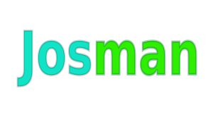

WARNING: THIS IS ONLY A TEMPLATE FOR THE DOCUMENTATION.  
RELEASE DOCS ARE ON THE <a href="http://opendatatrentino.github.io/josman-maven-plugin/" target="_blank">PROJECT WEBSITE</a>

 

#### About

Maven plugin for managing documentation of Java open source programs.

|Usage|License|Roadmap|Contributing|
|-----------|---------|-----------|----------------|
| See [docs](docs) |Business-friendly [Apache License v2.0](LICENSE.txt) | See [project milestones](../../milestones) | See [the wiki](../../wiki)|

**Features:**
  
  * well integrated with Github
  * modeled after  <a href="http://semver.org" target="_blank">semantic versioning</a> principles
  * allows maintainance of present and past versions of the sofware  
  * supports some scripting  
  * designed for Maven 3
  * supports Java 7+

#### Workflow

Josman is modeled after this workflow, where you:

1. create an open source project on Github
2. keep docs in source code, in folder `docs/` (i.e. see [josman docs](docs))
3. edit your markdown files and set relative links between them so they display nice in Github
4. release your library using <a href="http://semver.org" target="_blank">semantic versioning</a> and tag it with tagname `projectName-x.y.z` (i.e. `my-project-1.2.3`)
5. run Josman to create a corresponding github website (i.e. http://opendatatrentino.github.io/josman) out of the docs. 
6. spam the world with links to your new shiny project website
7. If you need to improve past versions, create a branch named `branch-x.y` (i.e `branch-1.2`)

Project wiki (i.e. [josman wiki](../../wiki)) is used for information about contributing to the project.

This way we 

* fully exploit all the existing editing features of Github
* reuse version information from git repo and Maven while generating the website
* let Josman perform the tedious tasks like checking versions, fixing links, publishing javadoc, ..
* evolve documention in separate branches
    * so if you have to patch something or just improve docs, just work in relative `branch-x.y` and then run Josman to publish it (even if it is not released).
    * if you need to add functionality, create new branch named `branch-x.y+1`

#### Credits

* David Leoni - DISI at University of Trento - david.leoni@unitn.it

Made with the contribution of:

 <a href="http://dati.trentino.it" target="_blank"> Open Data In Trentino Project </a>  

 <a href="http://kidf.eu" target="_blank"> Knowledge in Diversity Foundation </a>  
